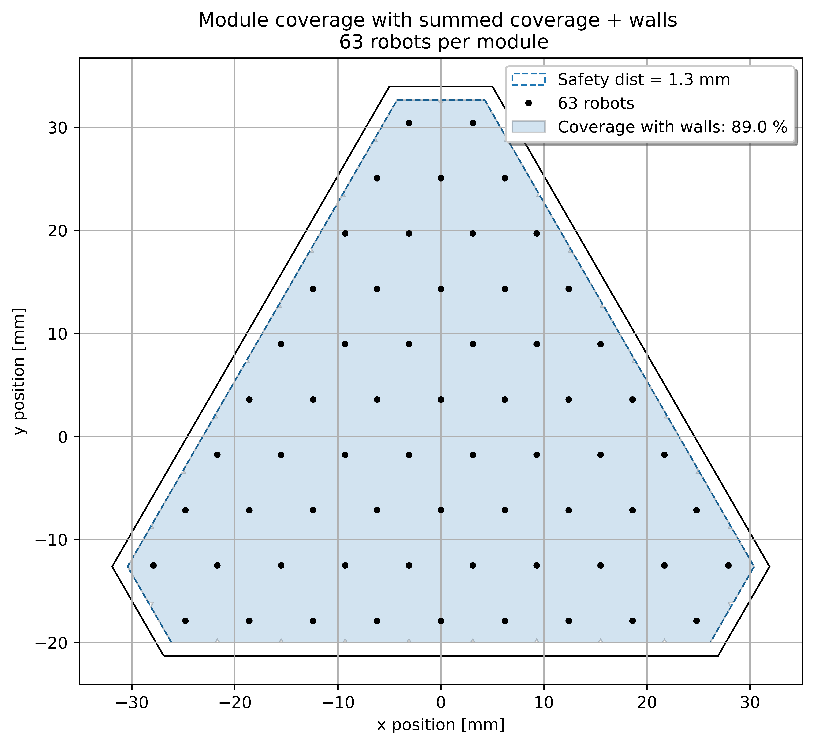
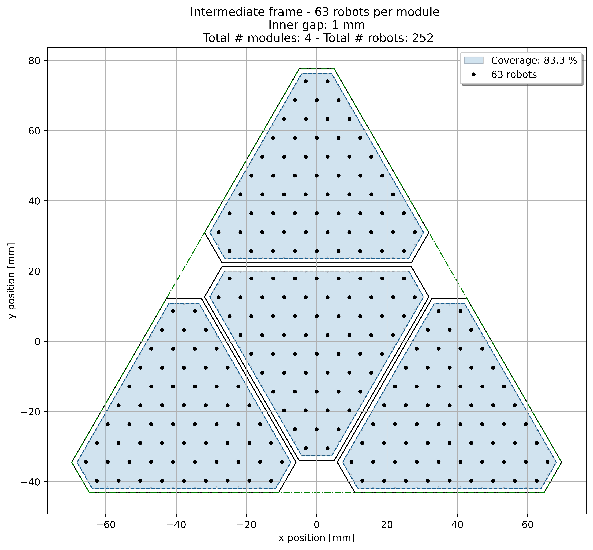

# Focal Plane Calculations

The current repo aims to be a design tool for multiplex modular telescopes.
It produces 2 main information:

1. Coverage: fraction of the vignetting area covered by the summed up workspaces of all the robots
2. Positions: 3D positions (x,y,z, $\theta$, $\phi$) of robots & modules within the focal plane

# Results examples

Typical resulting files can be found in *Results_examples* folder:

## Robots workspace in individual modules

The first output shows the smallest building blovk of this program. It shows the shape of a module of positioners, along with each individual workspace. As we are interested in the net coverages of each modules are summed up to calculate the net area covered by the positioners with a tirangular module.

Individual robots workspaces             |  Summed robots workspace
:-------------------------:|:-------------------------:
 |  

## Robots workspace in intermediate modules

The goal of this program is to study the impact of locally changing the gap between modules on the total coverage. They are thus packed by groups of 4 ideally without physical walls between them. The said gap is the *inner gap* variable in *focal_plane_covergae.py*.

## Total coverage

The modules are then placed 4 by 4 (in green) in the focal plane bounded by its vignetting radius (*vigR*). Individual modules (in blue) are used as we get closer to the edge of the vigR, more can be inserted as we increase the *out_allowance* parameter, which sets how much the workspace of a module is allowed to stick out of vigR.

